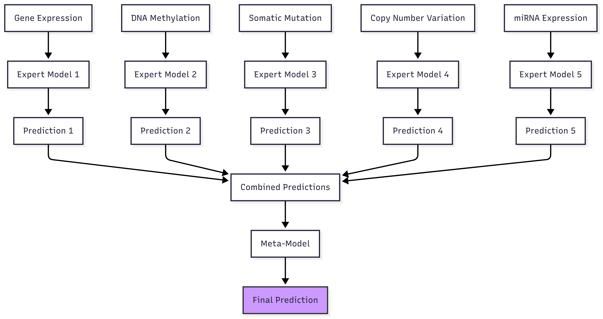

# 다중 오믹스(Multi-omics) 기반 암종 분류 및 XAI 분석

[](https://www.python.org/)
[](https://scikit-learn.org/)
[](https://lightgbm.readthedocs.io/)
[](https://shap.readthedocs.io/)

> [cite_start]5가지 종류의 TCGA 다중 오믹스 데이터를 통합하여 5개 암종을 분류하는 고성능 머신러닝 모델을 구축하고, XAI(설명 가능한 인공지능) 기법인 SHAP을 통해 모델의 예측 근거를 분석하여 해석 가능성을 확보한 프로젝트입니다. [cite: 90, 93, 94]

---

## 1. 프로젝트 개요

### 1.1. 목표

[cite_start]본 프로젝트의 핵심 목표는 TCGA에서 제공하는 다중 오믹스 데이터를 활용하여 주어진 암 샘플이 어떤 암종(Cancer Type)에 해당하는지 예측하는 고성능 분류 모델을 개발하는 것입니다. [cite: 93] [cite_start]여기서 더 나아가, 단순히 예측 결과를 도출하는 것을 넘어 **SHAP (SHapley Additive exPlanations)** 분석을 통해 어떤 오믹스 데이터와 세부 특징(유전자, 메틸레이션 사이트 등)이 모델의 결정에 중요한 영향을 미쳤는지 정량적으로 해석하는 것을 주요 목표로 삼았습니다. [cite: 94, 59]

### 1.2. 사용 데이터

-   [cite_start]**데이터 소스**: The Cancer Genome Atlas (TCGA) [cite: 93]
-   [cite_start]**분석 대상 암종 (5종류)**: 유방암(BRCA), 위암(STAD), 콩팥암(KIRC), 폐암(LUSC), 간암(LIHC) [cite: 100]
-   [cite_start]**활용 오믹스 데이터 (5종류)**: [cite: 42, 101]
    -   [cite_start]유전자 발현 (Gene Expression, RNA-seq) [cite: 102]
    -   [cite_start]DNA 메틸레이션 (DNA Methylation) [cite: 103]
    -   [cite_start]유전자 변이 (Somatic Mutation) [cite: 104]
    -   [cite_start]복제수 변이 (Copy Number Variation, CNV) [cite: 105]
    -   [cite_start]miRNA 발현 (miRNA Expression) [cite: 106]

---

## 2. 핵심 아키텍처: 계층적 앙상블 모델

[cite_start]본 프로젝트는 **스태킹 앙상블(Stacking Ensemble)** 기법에 기반한 계층적 진단 시스템(Tiered Diagnostic System) 전략을 채택하여 모델의 성능과 안정성을 높였습니다. [cite: 95, 52]



-   **Tier 1: 전문가 모델 (Expert Models)**
    [cite_start]5가지 오믹스 데이터 각각에 대해 독립적인 LightGBM 분류 모델을 학습시킵니다. [cite: 51] [cite_start]이를 통해 각 오믹스 데이터가 단독으로 갖는 예측 성능의 베이스라인을 설정하고, 각 데이터의 고유한 특성을 파악합니다. [cite: 96]
-   **Tier 3: 메타 모델 (Meta Model)**
    [cite_start]Tier 1 전문가 모델들이 생성한 예측 확률값(Out-of-Fold Predictions)을 새로운 입력 특징(Meta-Features)으로 사용합니다. [cite: 52] [cite_start]이 메타 특징들을 다시 LightGBM 모델로 학습하여, 모든 오믹스 정보를 종합적으로 판단하는 최종 모델을 구축합니다. [cite: 97, 52]

---

## 3. 실행 결과

### 3.1. Tier 1: 단일 오믹스 전문가 모델 성능

[cite_start]각 오믹스 데이터를 단독으로 사용하여 5-겹 교차 검증을 수행한 결과, **miRNA와 유전자 발현** 데이터가 암종 분류에 가장 강력한 예측 능력을 가진 것을 확인했습니다. [cite: 128] [cite_start]반면, 유전자 변이 데이터는 단독으로 사용 시 가장 낮은 성능을 보였습니다. [cite: 126]

| 순위 | 데이터 종류 | 교차 검증 평균 정확도 | 교차 검증 평균 AUC |
|:--:|:---|:---:|:---:|
| 1 | miRNA 발현 | [cite_start]**99.10%** [cite: 546] | [cite_start]0.9988 [cite: 548] |
| 2 | 유전자 발현 | [cite_start]98.67% [cite: 171] | [cite_start]0.9993 [cite: 173] |
| 3 | 메틸레이션 | [cite_start]98.12% [cite: 207] | [cite_start]0.9998 [cite: 209] |
| 4 | 복제수 변이 (CNV) | [cite_start]77.22% [cite: 424] | [cite_start]0.9231 [cite: 426] |
| 5 | 유전자 변이 (Mutation) | [cite_start]47.33% [cite: 360] | [cite_start]0.7755 [cite: 362] |

### 3.2. Tier 3: 최종 앙상블 모델 성능

[cite_start]5가지 전문가 모델의 예측을 통합한 최종 메타 모델은 5-겹 교차 검증에서 **평균 정확도 98.67%** 라는 매우 높은 성능을 달성했습니다. [cite: 500] [cite_start]이는 여러 오믹스 정보를 종합함으로써 단일 오믹스 모델의 한계를 보완하고, 더 강건하고 일관된 예측이 가능함을 시사합니다. [cite: 135, 136]

| **최종 앙상블 모델 성능** | **[최종 분류 리포트]** |
|:---:|:---:|
| [cite_start]**Accuracy: 98.67%** [cite: 500] |  |

---

## 4. 모델 해석 (XAI: Explainable AI)

본 프로젝트의 핵심 중 하나는 SHAP을 이용한 모델 해석입니다. [cite_start]예측의 'Why'를 설명하기 위해 두 가지 레벨에서 분석을 수행했습니다. [cite: 58, 139]

### 4.1. Level 1: 어떤 '특징'이 중요한가? (Feature-level Importance)

[cite_start]각 전문가 모델 내부에서 어떤 유전자, 어떤 메틸레이션 사이트가 예측에 큰 영향을 미쳤는지 분석합니다. [cite: 58] 아래는 유전자 발현 모델의 예측에 가장 큰 영향을 준 Top 20 유전자를 시각화한 예시입니다.

<p align="center">
  <b>[예시] 유전자 발현 모델의 Top 20 중요 특징</b><br>
  
</p>

### 4.2. Level 2: 어떤 '오믹스'가 중요한가? (Omics-level Importance)

[cite_start]최종 메타 모델을 분석하여, 5가지 오믹스 데이터(전문가 모델) 중 어떤 것의 예측이 최종 판단에 가장 크게 기여했는지 정량적으로 평가합니다. [cite: 58]

<p align="center">
  <b>최종 예측에 대한 오믹스별 기여도</b><br>
  
</p>

---

## 5. 사용 방법

### Repository 클론

```bash
git clone [https://github.com/SHowoSH/multiomics-cancer-xai.git](https://github.com/SHowoSH/multiomics-cancer-xai.git)
cd multiomics-cancer-xai
필요 라이브러리 설치
Bash

pip install -r requirements.txt
데이터 통합 (Step 1)
src/1_data_integration/ 내의 스크립트를 실행하여 오믹스 데이터를 통합하고 전처리합니다. (Gene 데이터 예시)

Bash

python src/1_data_integration/01_integrate_gene.py
전문가 모델 학습 (Step 2)
src/2_train_expert_models/02_train_expert_model.py 스크립트의 EXPERT_NAME을 gene으로 설정한 후, 전문가 모델을 학습시키고 OOF 예측 파일을 생성합니다.

Bash

python src/2_train_expert_models/02_train_expert_model.py
메타 모델 학습 (Step 3)
모든 전문가 모델의 OOF 예측 파일이 준비되면, src/3_train_meta_model/03a_train_multiclass_meta_model.py를 실행하여 최종 앙상블 모델을 학습하고 평가합니다.

Bash

python src/3_train_meta_model/03a_train_multiclass_meta_model.py
6. 향후 과제
본 연구를 통해 성공적으로 고성능 분류 모델을 개발하였으며, 다음과 같은 후속 연구를 제안합니다.

Tier 2 모델 개발: 100%에 가까운 성능을 보인 miRNA와 유전자 발현 데이터만 조합하는 등, 최소한의 데이터로 최대의 효율을 내는 '최적의 조합'을 탐색합니다.

암 vs. 정상 분류 모델 (Model B): 프로젝트 초기 목표였던 '암/정상 이진 분류' 모델 개발을 진행합니다. (해당 코드는 03b_train_binary_meta_model.py에 일부 구현되어 있습니다.)

임상 정보 통합: 현재의 순수 오믹스 모델에 나이, 성별, 병기 등의 임상 정보를 추가하여 모델 성능 향상 여부를 확인합니다.

하이퍼파라미터 최적화: GridSearchCV, Optuna 등의 기법을 사용하여 모델의 하이퍼파라미터를 정밀하게 튜닝하여 성능을 극대화합니다.